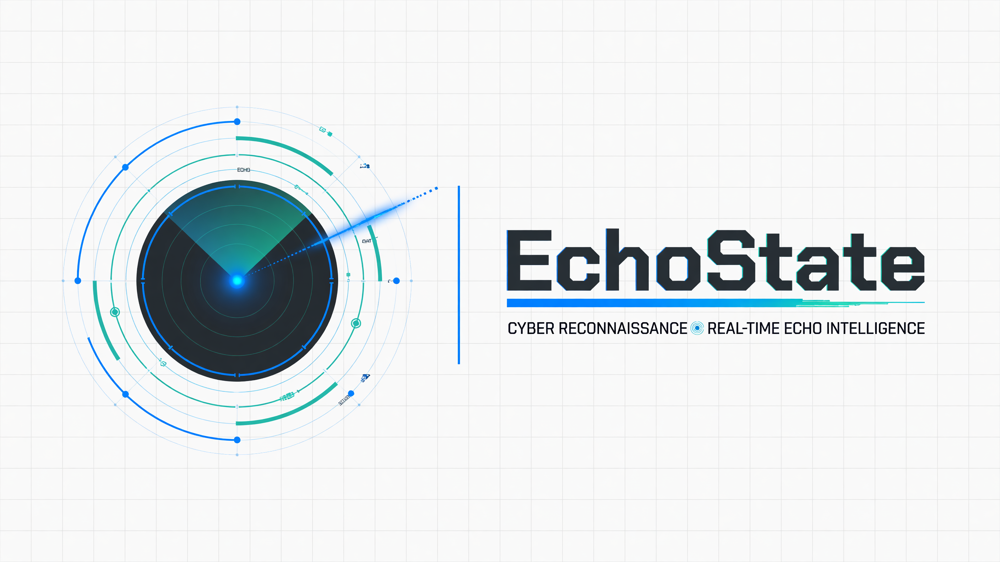

<p align="center">
  
</p>

# EchoState

EchoState is a passive reconnaissance platform: a Go API plus Next.js web UI for scanning hosts, tracking changes over time, and downloading PDF reports.

Feed it a hostname, IP, or URL and it gathers WHOIS, BGP/ASN, DNS, TLS certificate, traceroute, certificate transparency, and webpage intelligence concurrently. Snapshots persist for historical tracking — identical rescans update `last_seen`, retention can prune old rows per target, and admins can delete individual snapshots from the list. Submitter IPs are enriched asynchronously via [pWhois](https://pwhois.org/).

## Features

- **Passive recon** — WHOIS (with RDAP fallback), Team Cymru ASN/BGP (RIPEstat hijack-risk heuristics, AS-path enrichment, PeeringDB IX data), DNS (A/AAAA, MX, NS, TXT, CNAME, SOA, CAA, DNSSEC, PTR, DMARC, SPF/DKIM, MTA-STS, TLS-RPT, BIMI), TLS + JARM/JA3S (version, cipher, OCSP stapling), crt.sh subdomain + certificate metadata, multi-vantage traceroute (local + external), favicon MMH3, robots/security.txt/humans.txt/ads.txt/sitemap crawl (XML + plain-text), cloud bucket hints, HTTP redirect chains, HSTS preload check, cookie name fingerprint, security headers (HSTS, CSP, Permissions-Policy, Referrer-Policy, Cross-Origin-*), tech-stack fingerprinting, headless Chrome web scraping, and JPEG screenshot thumbnails.
- **Web UI** — Scan form (including **Scan & Report** with inline PDF download), target detail with tags and rescan, intel tabs (WHOIS, ASN, DNS, TLS, Web, Favicon, Crawl, Storage, CT, Traceroute, Screenshots, Submitter), snapshot detail with **Create report** (hydrates latest report on load, polls until PDF is ready), side-by-side raw diffs, and report downloads. Top nav includes **Profile** (all users) and **Settings** → `/admin/system` (admin). Snapshot and report list pages support delete (admin / scanner+). Light mode default; version shown in footer.
- **PWA / mobile** — Install as a standalone app (manifest + service worker shell cache); safe-area layout for notched phones; works best online (API calls are not offline-cached yet).
- **Historical tracking** — Snapshots persist; identical rescans update `last_seen`. Field-level `change_details` (severity, type, summary) highlight TLS expiry, CAA/DNSSEC/MTA-STS shifts, security.txt contacts, redirect chains, new CT certs, enrichment hits, BGP drift, and more.
- **Async scans** — `POST /api/scan` enqueues a job (`202`); poll `GET /api/scans/:id` for status and the resulting snapshot.
- **Scheduled rescans** — Background scheduler re-scans stale targets on a configurable interval.
- **PDF reports** — Async worker renders snapshot intel to PDF (maroto) with table of contents, branding, screenshot thumbnail, change summaries, and full intel sections; queue via **Create report** on a snapshot or `POST /api/reports`, then poll `GET /api/reports/:id` or download when `status` is `completed`. Downloads use `echostate-{host}-{date}.pdf` filenames.
- **IP enrichment** — pWhois worker enriches submitter IPs (org, ASN, geo).
- **Notifications** — Slack, Discord, MS Teams webhooks, and Pushover mobile alerts with structured change payloads and alert-rule filtering.
- **Settings** — DNS resolvers, DKIM selectors, pWhois server, rate limit, scan concurrency/timeouts, scheduler, retention, traceroute privacy (redact scanner LAN/ISP prefix on local paths), alert rules (graph drift + mail/DNS security presets, per-webhook filters), and optional Shodan/Censys/HIBP/RiskIQ/VirusTotal API keys.
- **Passkey authentication (beta.20+)** — WebAuthn passkeys with single-use enrollment/recovery codes; `admin` and `scanner` roles. See [Authentication](#authentication).
- **Legacy API key** — Optional `ECHOSTATE_API_KEY` still works for admin mutations when no users exist yet.
- **Neo4j graph** — Relationship sync on scan plus interactive `/graph` UI with infra, CT, DNS (NS/MX/CNAME/DMARC/SOA/CAA/MTA-STS/DNSSEC/BIMI), security.txt contacts, Wayback URLs, cert SAN, BGP, traceroute, and peering views; route diff, shared hops, intel events, and infra clusters.
- **Containerized** — Docker Compose: API, frontend, PostgreSQL, browserless Chrome, Neo4j.

> **Production note:** After bootstrapping the first admin, protected API routes require a signed-in passkey session. Until then, behavior matches earlier betas (optional API key for writes). Deploy behind TLS, set `ECHOSTATE_AUTH_PEPPER`, and see [SECURITY.md](SECURITY.md).

## Quick Start

```bash
cp .env.example .env
docker compose pull
docker compose up -d
```

Default compose pulls **`:beta`** images from GHCR (built on every `dev` branch push). For stable **`main`** builds:

```bash
docker compose -f docker-compose.yml -f docker-compose.prod.yml pull
docker compose -f docker-compose.yml -f docker-compose.prod.yml up -d
```

To build api/frontend from local source instead of pulling:

```bash
docker compose -f docker-compose.yml -f docker-compose.dev.yml up --build
```

| Service   | URL                         |
| --------- | --------------------------- |
| Web UI    | http://localhost:3001       |
| API       | http://localhost:8080       |
| Browser   | ws://localhost:3000/        |
| Neo4j     | bolt://localhost:7687       |

The UI proxies `/api` to the Go backend inside Docker — no CORS setup required for local use.

## Authentication

EchoState uses **passkeys (WebAuthn)** for day-to-day sign-in and **single-use codes** for first-time enrollment, new devices, and break-glass recovery. There are no passwords.

| Role | Access |
| ---- | ------ |
| `admin` | Full access — settings, users, webhooks, collections, notes, scans, reports |
| `scanner` | Scan, reports, read intel/graph/targets (no settings or user management) |

**Before the first admin exists**, the API behaves like earlier releases: read endpoints are open; write endpoints accept an optional legacy API key if configured.

**After bootstrap**, protected routes require an HTTP-only session cookie (`echostate_session`). The UI redirects unauthenticated users to `/login`.

Auth defaults (code length/TTL, session lifetime, attempt limits, WebAuthn RP ID/origin) are **admin-configurable in Admin → Authentication**.

### Environment variables

| Variable | Required | Purpose |
| -------- | -------- | ------- |
| `ECHOSTATE_AUTH_PEPPER` | Production | HMAC pepper for enrollment-code and session hashing |
| `ECHOSTATE_BREAK_GLASS_SECRET` | For CLI recovery | Secret for `echostate auth issue-admin-code` |
| `FRONTEND_URL` | Yes for passkeys | WebAuthn relying-party origin (e.g. `http://localhost:3001`) |

Set these in `.env` (Docker) or your shell (local `go run`). See `.env.example`.

### First-time setup

#### Docker

1. Start the stack (`docker compose up -d`).
2. Bootstrap the first admin (one-time):

   ```bash
   docker compose run --rm api auth bootstrap-admin --name "Admin"
   ```

   This prints a single-use **enrollment code**. `bootstrap-admin` fails with "admin user already exists" if an admin is already present — use [Recovery codes](#recovery-codes) instead.

3. Open **http://localhost:3001/login**, enter the code, then choose **Register passkey on this device** (or go to **Admin → Account & passkeys** after signing in).

#### Without Docker (local dev)

1. Start dependencies and the API:

   ```bash
   cp .env.example .env
   docker compose up db browser neo4j -d   # or your own Postgres + browserless
   go run ./main.go
   ```

2. Bootstrap:

   ```bash
   go run ./main.go auth bootstrap-admin --name "Admin"
   ```

3. Start the frontend (`cd frontend && npm run dev`), open **http://localhost:3000/login** (or whatever port Next uses), enter the code, then register a passkey on this device.

   For local Next dev, set `FRONTEND_URL` in `.env` to match the UI origin (e.g. `http://localhost:3000`) so WebAuthn RP ID/origin align.

### Sign-in flow (UI)

1. **Returning user** — `/login` → **Sign in with passkey** (uses the passkey registered in this browser).
2. **New device or first enrollment** — enter an **enrollment code** or **recovery code** → verify → **Register passkey on this device** or sign in with an existing passkey.
3. **Add passkey while signed in** — click your name in the nav → **Profile** → **Register passkey**.
4. **Another device** — **Profile** → **Issue device code** → enter code at `/login` on the new device.
5. **Sign out** — nav bar **Sign out** (or `POST /api/auth/logout`).

### Profile & administration

| Area | Path | Who |
| ---- | ---- | --- |
| **Profile** (name, theme, timezone, passkeys) | `/profile` — nav **Profile** link | All signed-in users |
| **Settings** (DNS, scan, retention, alert rules, API keys) | `/admin/system` — nav **Settings** link | Admin only |
| **Administration** (integrations, auth, users) | `/admin` — nav **Admin** link | Admin only |

**Profile** sections: display name, theme/timezone preferences, device enrollment codes, passkey management.

Administration sections: Integrations, System, Authentication, User management.

Legacy `/settings/*` URLs redirect to the paths above.

**User management** (admin):

- Create `admin` or `scanner` users
- Issue **enrollment codes** (numeric, for new passkey setup)
- Issue **recovery codes** (alphanumeric, break-glass / lost device)

### Recovery codes

When bootstrap has already run, use the CLI instead of `bootstrap-admin`:

**Docker:**

```bash
# ECHOSTATE_BREAK_GLASS_SECRET must be set in .env
docker compose run --rm api auth issue-admin-code
```

**Local binary:**

```bash
export ECHOSTATE_BREAK_GLASS_SECRET=your-secret
go run ./main.go auth issue-admin-code
```

Paste the printed code at `/login`.

### CLI reference

| Command | When to use |
| ------- | ----------- |
| `auth bootstrap-admin [--name "Admin"]` | First admin only (empty `users` table) |
| `auth issue-admin-code` | Recovery code when admin already exists |

> **Docker note:** use `docker compose run --rm api auth <command>`, not `docker compose exec api auth …` (exec does not invoke the image entrypoint correctly).

### API (auth endpoints)

| Endpoint | Description |
| -------- | ----------- |
| `GET /api/auth/config` | Auth required flag + public tunables |
| `GET /api/auth/session` | Current session (`authenticated`, `user`, `credentials`) |
| `POST /api/auth/enroll/verify` | Verify enrollment/recovery code (`{"code":"..."}`) |
| `POST /api/auth/webauthn/register/begin` | Start passkey registration |
| `POST /api/auth/webauthn/register/finish` | Complete passkey registration |
| `POST /api/auth/webauthn/login/begin` | Start passkey sign-in |
| `POST /api/auth/webauthn/login/finish` | Complete passkey sign-in |
| `POST /api/auth/logout` | End session |
| `PATCH /api/auth/profile` | Update display name, theme, and/or timezone |
| `POST /api/auth/device-code` | Issue single-use device enrollment code (signed-in user) |
| `PATCH /api/users/:id/credentials/:credId` | Rename passkey nickname |
| `GET/POST /api/users` | List/create users (admin) |
| `POST /api/users/:id/codes` | Issue enrollment/recovery code (admin) |

## API

### Health

```bash
curl http://localhost:8080/health
# {"status":"ok","env":"development","version":"0.0.1-beta.38"}
```

### Scan a target

```bash
# Enqueue scan (202 Accepted)
curl -X POST http://localhost:8080/api/scan \
  -H "Content-Type: application/json" \
  -d '{"host":"example.com"}'
# {"id":"<job-uuid>","status":"pending",...}

# Poll until completed
curl http://localhost:8080/api/scans/<job-uuid>
```

When `status` is `completed`, the response includes the snapshot with `raw_data` (`whois`, `asn`, `dns`, `tls`, `web`, `ct`, `traceroute`, `screenshot`, `favicon`, `crawl`, `storage`, `errors`) and `change_details` vs the previous snapshot.

If auth is not required yet and `ECHOSTATE_API_KEY` is set, pass `Authorization: Bearer <key>` or `X-API-Key: <key>` on write requests. After bootstrap, use a session cookie from `/login` or the auth endpoints above.

Rescanning a target uses the same endpoint — there is no separate rescan API.

### Browse & manage

| Endpoint | Description |
| -------- | ----------- |
| `GET /api/targets` | Paginated targets (`page`, `limit`, `q`) |
| `GET /api/targets/:id` | Target detail + latest snapshot |
| `PUT /api/targets/:id/tags` | Update target tags |
| `GET /api/targets/:id/snapshots` | Snapshots for a target |
| `GET /api/targets/:id/screenshots` | Screenshot timeline (base64 JPEG thumbnails) |
| `GET /api/snapshots` | All snapshots (`target_id` filter) |
| `GET /api/snapshots/:id` | Full snapshot with pWhois data |
| `GET /api/snapshots/:id/diff` | Raw JSON diff vs previous snapshot |
| `DELETE /api/snapshots/:id` | Delete snapshot (admin) |
| `GET /api/snapshots/:id/report` | Queue or fetch report for a snapshot |
| `GET /api/reports` | Report list (`status`, `snapshot_id`) |
| `POST /api/reports` | Queue PDF (`{"snapshot_id":"..."}`) |
| `DELETE /api/reports/:id` | Delete report row (scanner+) |
| `GET /api/reports/:id/download` | Download completed PDF |
| `GET/POST/PUT/DELETE /api/webhooks` | Webhook management |
| `GET /api/scans/:id` | Async scan job status (+ snapshot when complete) |
| `GET/PUT /api/settings` | System settings (DNS, pWhois, rate limit, scheduler, retention, alert rules, API keys) |
| `GET /api/graph` | Infrastructure graph (`?target_id=` optional; `?view=` = `infra`, `ct`, `dns`, `cert`, `bgp`, `traceroute`, `peering`) |

## Development

### Requirements

- Go 1.26+
- Node.js 24+ (frontend)
- PostgreSQL 16+
- browserless/chrome or another CDP WebSocket endpoint
- Neo4j 5+ (optional; included in Compose)

### Backend

```bash
cp .env.example .env
docker compose up db browser neo4j -d   # or point env vars yourself
go run ./main.go
```

### Frontend

```bash
cd frontend
npm install
cp .env.local.example .env.local   # NEXT_PUBLIC_API_URL=http://localhost:8080
npm run dev
```

### Tests

```bash
# Backend (excludes frontend/node_modules Go shim)
go test $(go list ./... | grep -v '/frontend/')

# Frontend
cd frontend && npm run typecheck && npm run build

# E2E (requires full docker compose stack)
cd frontend && npx playwright test
```

## Architecture

See **[appmap.md](appmap.md)** for a full application map: workers, gatherers, `raw_data` keys, Postgres/Neo4j schema, API routes, and frontend pages.

```
echostate/
├── main.go                 # Entry point, workers, HTTP server
├── internal/
│   ├── config/             # Environment + runtime settings
│   ├── db/                 # PostgreSQL migrations + Neo4j graph sync
│   ├── handlers/           # Gin routes (scan, browse, graph, reports, settings)
│   ├── middleware/         # CORS, rate limiting
│   ├── models/             # Domain types
│   ├── pwhois/             # Async IP enrichment worker
│   ├── reports/            # Async PDF worker
│   ├── scanner/            # WHOIS, ASN, DNS, TLS, CT, traceroute, favicon, crawl, storage, web, screenshot gatherers
│   ├── version/            # Build-time version injection
│   ├── webhooks/           # Snapshot notification dispatcher (Slack, Discord, Teams, Pushover)
│   └── pdf/                # PDF report renderer (maroto)
└── frontend/               # Next.js static export + nginx
```

## Releases

Tagged releases (`v*`) trigger:

- **GitHub Release** — Linux and macOS binaries (amd64 + arm64)
- **GHCR images** — `ghcr.io/notfixingit3/echostate` (API) and `ghcr.io/notfixingit3/echostate-frontend`
  - `:beta` — latest `dev` branch build (default `docker compose`)
  - `:main` — latest `main` branch build (`docker-compose.prod.yml`)
  - `:0.0.1-beta.N` — semver pin from release tags (pin **both** API and frontend to the same tag)

Pre-release tags containing `beta`, `alpha`, or `rc` are marked as GitHub pre-releases.

Bump the root `VERSION` file and run `./scripts/sync-version.sh` before tagging. Pin a specific release with `ECHOSTATE_API_IMAGE` / `ECHOSTATE_FRONTEND_IMAGE` in `.env`.

## Third-party software & services

EchoState depends on open-source libraries, Docker images, and many external data APIs (some **free**, some **paid or quota-limited**). See **[THIRD_PARTY.md](THIRD_PARTY.md)** for:

- Direct Go and npm dependency licenses
- Container image licenses
- Passive scan data sources (crt.sh, RIPEstat, PeeringDB, etc.)
- Optional enrichment APIs (Shodan, Censys, HIBP, RiskIQ, VirusTotal) and their cost models

## License

EchoState is [MIT](LICENSE). Third-party components are governed by their own licenses — see [THIRD_PARTY.md](THIRD_PARTY.md).