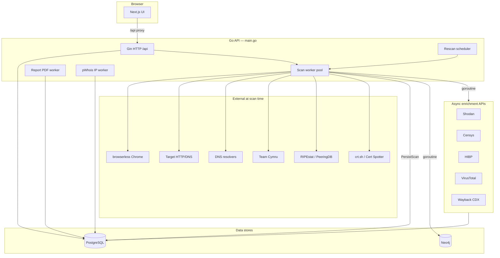

# EchoState Application Map

Developer-oriented map of routes, packages, data stores, background workers, and how intel flows through the system. For user-facing docs see [README.md](README.md); for licenses and external APIs see [THIRD_PARTY.md](THIRD_PARTY.md).

---

## Runtime topology



| Service (Compose) | Port | Role |
|-----------------|------|------|
| `frontend` | 3001 | Static Next.js UI, proxies `/api` |
| `api` | 8080 | Go backend |
| `db` | 5432 | PostgreSQL |
| `neo4j` | 7687 | Graph relationships |
| `browser` | 3000 | browserless Chrome (CDP) |

---

## Entry points

| Entry | Path | Notes |
|-------|------|-------|
| API server | `main.go` | Starts Gin, workers, optional Neo4j + pWhois |
| CLI auth | `main.go auth …` | `bootstrap-admin`, `issue-admin-code` → `internal/cli` |
| Route registration | `internal/handlers/scan.go` → `Register()` | All `/api/*` routes |
| Frontend pages | `frontend/app/**/page.tsx` | App Router (static export) |

---

## Background workers

| Worker | Package | Trigger | Output |
|--------|---------|---------|--------|
| **Scan** | `internal/scans` | `POST /api/scan`, scheduler, collection rescan | Snapshot row + side effects |
| **Enrichment** | `internal/enrichment` | Goroutine after each new snapshot | Updates `raw_data.enrichment`, may append `change_details` |
| **Report PDF** | `internal/reports` | `POST /api/reports`, snapshot report | `reports.pdf` bytea |
| **pWhois** | `internal/pwhois` | Polls snapshots with `client_ip` | Denormalized pWhois columns on snapshot |
| **Scheduler** | `internal/scheduler` | Timer (Settings) | Enqueues stale target rescans |
| **Retention** | `internal/retention` | After persist | Prunes old snapshots per target keep-N |

---

## Scan pipeline

```
POST /api/scan
  → scan_jobs (pending)
  → Scan worker: scanner.Run(host)
  → finalizeScanResult (merge web→storage buckets)
  → handlers.PersistScan
       → upsert targets
       → dedup by data_hash (update last_seen OR insert snapshot)
       → compute diff vs previous → changes + change_details
       → snapshot_blobs (JPEG thumbnail)
       → [async] Neo4j SyncSnapshot
       → [async] webhooks.Dispatch
       → [async] enrichment.EnrichSnapshot
       → [async] retention.PruneTargetSnapshots
```

**Dedup:** `internal/scanner/hash.go` — volatile fields (screenshot bytes, enrichment, timestamps) excluded from hash.

**Diff:** `internal/diff` — TLS, BGP, graph drift, CT, DNS/mail/crawl intel, web, enrichment (`internal/enrichment/diff.go`).

---

## Gatherers (`internal/scanner`)

Registered in `NewScanner()` — all run **concurrently** with per-gatherer timeouts from Settings.

| Key | Function | Primary `raw_data` fields | External deps |
|-----|----------|---------------------------|---------------|
| `whois` | `gatherWHOIS` | `whois.*` (registrar, dates, NS, raw) | Classic WHOIS; RDAP fallback (`rdap.go`) |
| `asn` | `gatherASN` | `asn.asn`, `prefix`, `ip`, `routing.*`, `peeringdb.*` | Team Cymru DNS, RIPEstat, PeeringDB |
| `tls` | `gatherTLS` | `tls.issuer`, `days_remaining`, `jarm`, `ja3s`, `chain`, `tls_version`, `ocsp_stapled` | Direct TLS :443 |
| `dns` | `gatherDNS` | `dns.A`, `AAAA`, `MX`, `NS`, `TXT`, `CNAME`, `SOA`, `SPF`, `DMARC_PARSED`, `DKIM`, `CAA`, `DNSSEC`, `BIMI`, `MTA_STS`, `TLS_RPT`, `MAIL_POSTURE`, `PTR` | Configured resolvers |
| `favicon` | `gatherFavicon` | `favicon.mmh3`, `sha256`, `url` | HTTP fetch |
| `crawl` | `gatherCrawl` | `crawl.robots`, `security_txt`, `sitemap_urls`, `humans_txt`, `ads_txt` | HTTP fetch |
| `storage` | `gatherStorage` | `storage.buckets`, `provider_hints` | HTML/URL pattern hints |
| `ct` | `gatherCT` | `ct.subdomains`, `ct.certificates`, `count` | crt.sh; Cert Spotter fallback |
| `traceroute` | `gatherTraceroute` | `traceroute.vantages[]`, hops, geo | Local + HackerTarget vantage; local paths may redact scanner LAN/ISP prefix (`TracerouteRedactScannerPrefix`) |
| `web` | `newWebGatherer` | `web.title`, `headers`, `security_headers`, `redirect_chain`, `meta`, `cookie_names`, `hsts_preload`, WordPress plugins/themes | Chrome CDP + HTTP |
| `screenshot` | `newScreenshotGatherer` | `screenshot.url`, dimensions; thumbnail → `snapshot_blobs` | Chrome CDP JPEG |

Errors accumulate in `raw_data.errors[]` without failing the whole scan.

---

## Enrichment (`raw_data.enrichment`)

Runs **after** snapshot insert. Initial snapshot may have `enrichment.status: "pending"`.

| Provider key | Requires API key | Package |
|--------------|------------------|---------|
| `shodan` | Yes | `enrichment/shodan.go` |
| `censys` | Yes (ID + secret) | `enrichment/censys.go` |
| `hibp` | Yes | `enrichment/hibp.go` |
| `riskiq` | Yes (user + key) | `enrichment/riskiq.go` |
| `wayback` | No | `enrichment/wayback.go` |
| `virustotal` | Yes | `enrichment/virustotal.go` |

Report worker can wait up to **45s** when `wait_for_enrichment` is set (`internal/reports/worker.go`).

---

## PostgreSQL schema (core)

Defined in `internal/db/db.go` → `Migrate()`.

| Table | Purpose |
|-------|---------|
| `targets` | Canonical host, tags, `normalized_host` |
| `snapshots` | `raw_data` JSONB, `changes`, `change_details`, `data_hash`, pWhois denorm columns |
| `snapshot_blobs` | Offloaded binary (screenshot thumbnails) |
| `scan_jobs` | Async scan queue state |
| `reports` | PDF job queue + `pdf` bytea |
| `webhooks` | Slack/Discord/Teams/Pushover integrations |
| `settings` | Key/value JSON (system settings blob) |
| `target_collections` / `target_collection_members` | Watchlists |
| `investigation_notes` | Markdown notes + refs |
| `graph_views` | Saved graph lenses |
| `users`, `enrollment_codes`, `webauthn_credentials`, `sessions`, … | Passkey auth |

---

## Neo4j graph (`internal/db`)

Synced on each snapshot via `Neo4jClient.SyncSnapshot()` (async).

| Sync function | Nodes / edges (examples) |
|---------------|--------------------------|
| `syncBGPGraph` | `Prefix`, `ASN`, `ANNOUNCES`, `VISIBLE_ORIGIN`, AS paths |
| `syncCTGraph` | `Subdomain`, `DISCOVERED_VIA_CT` |
| `syncCertSANGraph` | `CertSAN`, `HAS_SAN` |
| `syncDNSGraph` | `DNSHost`, `USES_NS/MX`, `DMARCPolicy`, `SOAZone` |
| `syncMailDNSIntelGraph` | `CAARecord`, `MTASTSPolicy`, `DNSSECStatus`, `BIMIRecord` |
| `syncCrawlIntelGraph` | `SecurityContact` |
| `syncWaybackGraph` | `WaybackURL` |
| `syncTracerouteGraph` | `Hop`, `SharedHop`, `NEXT_HOP` |
| `syncPeeringGraph` | `IX`, `PRESENT_AT_IX` |
| Target infra | `JARM`, `JA3S`, `Favicon`, `CertIssuer`, `IP` |
| `syncIntelEvents` | `IntelEvent` from `change_details` |
| `syncEnrichmentHits` | `EnrichmentHit` |

**Graph API:** `GET /api/graph?view=` — `infra`, `bgp`, `traceroute`, `peering`, `ct`, `dns`, `cert` (`internal/handlers/graph.go`, `internal/db/neo4j_graph.go`).

---

## HTTP API map

Auth: `SessionAuth` on `/api/*`; role gates `scanner` vs `admin`. See [README § API](README.md#api).

| Group | Methods | Role | Handler file |
|-------|---------|------|--------------|
| Health | `GET /health`, `GET /api/version` | Public | `scan.go` |
| Auth | `POST /api/auth/*`, profile, device codes | Mixed | `auth.go` |
| Scan | `POST /api/scan`, `GET /api/scans/:id` | scanner | `scan.go` |
| Targets / snapshots | CRUD read, tags, diff, screenshots; `DELETE /api/snapshots/:id` | scanner/admin | `browse.go`, `snapshot.go` |
| Reports | `POST/GET/DELETE /api/reports`, download | scanner | `reports.go`, `browse.go` |
| Graph | `GET /api/graph`, graph views CRUD | scanner/admin | `graph.go`, `graph_views.go` |
| Settings / webhooks | `GET/PUT /api/settings`, webhooks CRUD | admin | `settings.go`, `webhooks.go` |
| Collections / notes | CRUD, bulk rescan | mixed | `collections.go`, `notes.go` |
| Users | CRUD, codes, credentials | admin/scanner | `users.go` |
| Export / import | `GET /api/export`, `POST /api/import` | admin | `transfer.go` |

---

## Frontend map

| Route | Page | Main components |
|-------|------|-----------------|
| `/` | Home scan form | `scan-form`, result card, Scan & Report |
| `/targets` | Target list | `targets-table` |
| `/target` | Target detail | `target-detail`, snapshots, intel tabs |
| `/snapshots` | Global snapshot list | `snapshots-table` (admin delete) |
| `/snapshot` | Snapshot detail | `snapshot-detail`, `intel-summary`, `intel-panels` |
| `/graph` | Force graph | `graph-canvas`, toolbar, saved views |
| `/collections` | Watchlists | collection CRUD, bulk rescan |
| `/notes` | Investigation notes | compose, archive/trash |
| `/reports` | Report list | `reports-table` (delete), download |
| `/report` | Single report | download link |
| `/login` | Passkey auth | enrollment / WebAuthn |
| `/profile` | User prefs | theme, timezone, passkeys |
| `/admin/*` | Server admin | integrations, system, auth, users |
| `/settings/*` | Legacy redirects | → `/admin` or `/profile` |

**Intel field lists:** `frontend/lib/intel.ts` — drives tabs, highlights, PDF parity.

**API client:** `frontend/lib/api.ts` — cookie session, typed fetch helpers (`deleteSnapshot`, `deleteReport`).

**PWA:** `public/manifest.webmanifest`, `public/sw.js` (shell cache; skips `/api/`), `components/pwa-register.tsx`, icons under `public/icons/` (any + maskable; regenerate via `scripts/generate-pwa-icons.py`).

**Bulk list actions:** `components/bulk-action-bar.tsx`, `lib/use-table-selection.ts` — multi-select delete on `snapshots-table` (admin) and `reports-table` (scanner+).

**E2E:** `frontend/e2e/` — Playwright global setup (Compose + bootstrap), `auth.setup.ts` (virtual WebAuthn), smoke/auth/delete/report specs. See [DEPLOY.md](DEPLOY.md).

---

## Package directory

```
echostate/
├── main.go
├── internal/
│   ├── auth/           WebAuthn, sessions, enrollment codes
│   ├── cli/            auth bootstrap CLI
│   ├── config/         env + runtime SystemSettings / AlertRules
│   ├── db/             Postgres, migrations, Neo4j sync + graph queries
│   ├── diff/           Snapshot change_details engine
│   ├── enrichment/     Async third-party correlation
│   ├── export/         Bundle import/export
│   ├── handlers/       Gin routes (thin)
│   ├── middleware/     CORS, rate limit, session auth
│   ├── models/         Domain types
│   ├── notes/          Note sanitization
│   ├── pdf/            Maroto PDF renderer
│   ├── pwhois/         Submitter IP enrichment worker
│   ├── reports/        PDF job worker
│   ├── retention/      Snapshot pruning
│   ├── scanner/        All passive gatherers
│   ├── scans/          Scan job queue worker
│   ├── scheduler/      Stale target rescans
│   ├── version/        Build version + update check
│   └── webhooks/       Change notification dispatcher
└── frontend/
    ├── app/            Next.js pages
    ├── components/     UI + intel panels
    └── lib/            api, intel, types, help-copy
```

---

## Notifications & alerts

1. Snapshot stored with non-empty `change_details` or `changes`.
2. `webhooks.Dispatch` loads enabled webhooks + `settings.alert_rules`.
3. `diff.MatchesRule` filters by `match_types` + `min_severity` + optional webhook IDs.
4. Payload: JSON with structured `changes[]` or Pushover formatted text.

Default rules in `internal/config/settings.go`: critical-all, warnings, graph-drift, mail-security.

---

## PDF reports

```
POST /api/reports { snapshot_id, wait_for_enrichment? }
  → reports row (pending)
  → Report worker loads snapshot + pWhois + prior change_details
  → optional wait for enrichment.completed
  → pdf.RenderReport (internal/pdf/renderer.go)
  → reports.pdf + status completed
```

---

## Related docs

| Doc | Contents |
|-----|----------|
| [README.md](README.md) | Quick start, auth, API examples |
| [THIRD_PARTY.md](THIRD_PARTY.md) | Dependency licenses + paid/free APIs |
| [TODO.md](TODO.md) | Feature roadmap status |
| [CHANGELOG.md](CHANGELOG.md) | Release notes |
| [SECURITY.md](SECURITY.md) | Vulnerability reporting, auth hardening |
| [CONTRIBUTING.md](CONTRIBUTING.md) | Dev workflow, PR checklist |